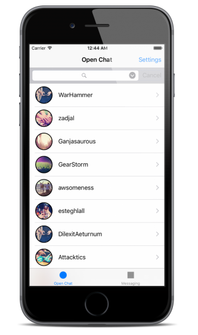

# About Sample Project

## Download Sample Project

You can download the sample project from this [link](https://github.com/smilefam/mymessenger_tutorial.git):

## Features

The project implements 4 features for a general chat and messaging app.

* Open chat
* 1-on-1 messaging
* Group messaging
* Profile settings

**Open chat** is a public chat. This is a channel which can be participated by anyone can join without an admission. The channel can be created on JIVER dashboard or via the server API.

**1-on-1 messaging** is a private channel between two users. **Group messaging** is a private channel shared among multiple users. The user who wants to join the **Group messaging** channel has to be invited by other user who is already joined the **Group messaging** channel.

**Profile settings** have a profile image and a nickname which are used in channels.

   
