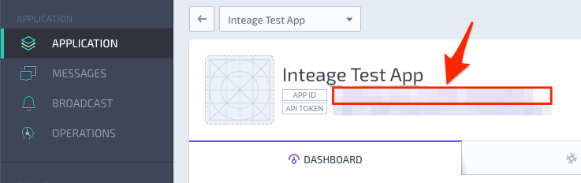

# Create an Application on JIVER Dashboard

You must first create an application on JIVER Dashboard before being able to using it for your project. 

1. Sign in at [JIVER Dashboard](https://dashboard.jiver.co).
1. Select **APPLICATION** on the side menu and click the **NEW APP**.
1. Fill up the form about your application and click **CREATE** button.

You can see **APP ID** of your application on the dashboard like this:

**APP ID** will be used for the initialization of iOS framework.