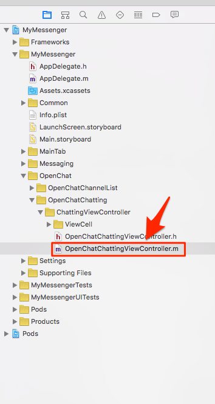

# Implement 1-on-1 Messaging

1-on-1 messaging needs two users. JIVER identifies each user with User ID. The sample project provides the feature for messaging which the user can choose another user for obtaining ID of the user in the open chat channel.

## Start messaging

You need opponent's user ID in order to start 1-on-1 messaging. Each message in open chat has the sender's user ID. We will use it for messaging.

Open **OpenChatChattingViewController.m** in Xcode.



Implement [tableView:didSelectRowAtIndexPath:](https://developer.apple.com/library/ios/documentation/UIKit/Reference/UITableViewDelegate_Protocol/#//apple_ref/occ/intfm/UITableViewDelegate/tableView:didSelectRowAtIndexPath:) for getting the user ID of the message's sender.

```objectivec
- (void)tableView:(UITableView *)tableView didSelectRowAtIndexPath:(NSIndexPath *)indexPath
{
    UIAlertController *messageSubMenu;
    UIAlertAction *messageAction;
    UIAlertAction *messageCancelAction;

    if ([[messages objectAtIndex:indexPath.row] isKindOfClass:[JiverMessage class]]) {
        JiverMessage *message = (JiverMessage *)[messages objectAtIndex:indexPath.row];
        
        if ([[[message sender] guestId] isEqualToString:[Jiver getUserId]]) {
            return;
        }
        
        NSString *actionTitle = [NSString stringWithFormat:@"Start messaging with %@", [message getSenderName]];
        messageSubMenu = [UIAlertController alertControllerWithTitle:nil message:nil preferredStyle:UIAlertControllerStyleActionSheet];
        messageAction = [UIAlertAction actionWithTitle:actionTitle style:UIAlertActionStyleDefault handler:^(UIAlertAction * _Nonnull action) {
            [Jiver startMessagingWithUserId:[[message sender] guestId]];
        }];
        messageCancelAction = [UIAlertAction actionWithTitle:@"Cancel" style:UIAlertActionStyleCancel handler:^(UIAlertAction * _Nonnull action) {}];
        [messageSubMenu addAction:messageAction];
        [messageSubMenu addAction:messageCancelAction];
        
        [self presentViewController:messageSubMenu animated:YES completion:nil];
    }
    else {
        return;
    }
}
```

You can see ```UIAlertController``` when you click other's message in the open chat like this:


If you click "Start messaging with OPPONENT_NAME", then [Jiver startMessagingWithUserId:](http://docs.jiver.co/ref/ios/en/Classes/Jiver.html#//api/name/startMessagingWithUserId:) is invoked. When it is invoked and succeeded, the callback [messagingStartedBlock:](http://docs.jiver.co/ref/ios/en/Classes/Jiver.html#//api/name/setEventHandlerConnectBlock:errorBlock:channelLeftBlock:messageReceivedBlock:systemMessageReceivedBlock:broadcastMessageReceivedBlock:fileReceivedBlock:messagingStartedBlock:messagingUpdatedBlock:messagingEndedBlock:allMessagingEndedBlock:messagingHiddenBlock:allMessagingHiddenBlock:readReceivedBlock:typeStartReceivedBlock:typeEndReceivedBlock:allDataReceivedBlock:messageDeliveryBlock:) will be invoked as well. The callback returns [JiverMessagingChannel](http://docs.jiver.co/ref/ios/en/Classes/JiverMessagingChannel.html) object, then you and the opponent can join the channel.

 You should insert codes for joining the channel in [messagingStartedBlock:](http://docs.jiver.co/ref/ios/en/Classes/Jiver.html#//api/name/setEventHandlerConnectBlock:errorBlock:channelLeftBlock:messageReceivedBlock:systemMessageReceivedBlock:broadcastMessageReceivedBlock:fileReceivedBlock:messagingStartedBlock:messagingUpdatedBlock:messagingEndedBlock:allMessagingEndedBlock:messagingHiddenBlock:allMessagingHiddenBlock:readReceivedBlock:typeStartReceivedBlock:typeEndReceivedBlock:allDataReceivedBlock:messageDeliveryBlock:). Note the codes in ```messagingStartedBlock:```.
 
 ```objectivec
- (void)viewDidLoad {
    // ...
    
    [Jiver loginWithUserId:[Jiver deviceUniqueID] andUserName:[MyUtils getUserName] andUserImageUrl:[MyUtils getUserProfileImage] andAccessToken:@""];
    [Jiver joinChannel:[currentChannel url]];
    [Jiver setEventHandlerConnectBlock:^(JiverChannel *channel) {
        
    } errorBlock:^(NSInteger code) {
        
    } channelLeftBlock:^(JiverChannel *channel) {
        
    } messageReceivedBlock:^(JiverMessage *message) {
        if (lastMessageTimestamp < [message getMessageTimestamp]) {
            lastMessageTimestamp = [message getMessageTimestamp];
        }
        
        if (firstMessageTimestamp > [message getMessageTimestamp]) {
            firstMessageTimestamp = [message getMessageTimestamp];
        }
        
        if ([message isPast]) {
            [messages insertObject:message atIndex:0];
        }
        else {
            [messages addObject:message];
        }
        [self scrollToBottomWithReloading:YES animated:NO];
    } systemMessageReceivedBlock:^(JiverSystemMessage *message) {
        
    } broadcastMessageReceivedBlock:^(JiverBroadcastMessage *message) {
        if (lastMessageTimestamp < [message getMessageTimestamp]) {
            lastMessageTimestamp = [message getMessageTimestamp];
        }
        
        if (firstMessageTimestamp > [message getMessageTimestamp]) {
            firstMessageTimestamp = [message getMessageTimestamp];
        }
        
        if ([message isPast]) {
            [messages insertObject:message atIndex:0];
        }
        else {
            [messages addObject:message];
        }
        [self scrollToBottomWithReloading:YES animated:NO];
    } fileReceivedBlock:^(JiverFileLink *fileLink) {
        if (lastMessageTimestamp < [fileLink getMessageTimestamp]) {
            lastMessageTimestamp = [fileLink getMessageTimestamp];
        }
        
        if (firstMessageTimestamp > [fileLink getMessageTimestamp]) {
            firstMessageTimestamp = [fileLink getMessageTimestamp];
        }
        
        if ([fileLink isPast]) {
            [messages insertObject:fileLink atIndex:0];
        }
        else {
            [messages addObject:fileLink];
        }
        [self scrollToBottomWithReloading:YES animated:NO];
    } messagingStartedBlock:^(JiverMessagingChannel *channel) {
        UIStoryboard *storyboard = [self storyboard];
        MessagingViewController *vc = [storyboard instantiateViewControllerWithIdentifier:@"MessagingViewController"];
        [vc setMessagingChannel:channel];
        [vc setDelegate:self];
        [self presentViewController:vc animated:YES completion:nil];
    } messagingUpdatedBlock:^(JiverMessagingChannel *channel) {
        
    } messagingEndedBlock:^(JiverMessagingChannel *channel) {
        
    } allMessagingEndedBlock:^{
        
    } messagingHiddenBlock:^(JiverMessagingChannel *channel) {
        
    } allMessagingHiddenBlock:^{
        
    } readReceivedBlock:^(JiverReadStatus *status) {
        
    } typeStartReceivedBlock:^(JiverTypeStatus *status) {
        
    } typeEndReceivedBlock:^(JiverTypeStatus *status) {
        
    } allDataReceivedBlock:^(NSUInteger jiverDataType, int count) {
        
    } messageDeliveryBlock:^(BOOL send, NSString *message, NSString *data, NSString *messageId) {
        
    }];
}
```

These codes get a view controller for messaging from the storyboard and is set by the channel which returned from the block. Finally, the view controller is started.

## Implement Messaging

```MessagingViewController.m``` is invoked by ```messagingStartedBlock:``` in ```OpenChatChattingViewController.m```. Open ```MessagingViewController.m``` in Xcode to implement a messaging that includes a transfering a message, a typing indicator and an unread message count.


Modify ```viewDidLoad``` method for initialzation a messaging. 

```objectivec
- (void)viewDidLoad {
    [super viewDidLoad];
    // Do any additional setup after loading the view.
    
    [[NSNotificationCenter defaultCenter] addObserver:self
                                             selector:@selector(keyboardWillShow:)
                                                 name:UIKeyboardWillShowNotification
                                               object:nil];
    
    [[NSNotificationCenter defaultCenter] addObserver:self
                                             selector:@selector(keyboardWillHide:)
                                                 name:UIKeyboardWillHideNotification
                                               object:nil];
    
    isLoadingMessage = NO;
    firstTimeLoading = YES;
    lastMessageTimestamp = LLONG_MIN;
    firstMessageTimestamp = LLONG_MAX;
    scrollLocked = NO;
    
    messages = [[NSMutableArray alloc] init];
    
    [self.sendFileButton.layer setBorderColor:[[UIColor blueColor] CGColor]];
    [self.sendMessageButton.layer setBorderColor:[[UIColor blueColor] CGColor]];
    [self.messageTextField.layer setBorderColor:[[UIColor blueColor] CGColor]];
    
    [self.messagingTableView setDelegate:self];
    [self.messagingTableView setDataSource:self];
    [self.messagingTableView setSeparatorColor:[UIColor clearColor]];
    [self.messagingTableView setContentInset:UIEdgeInsetsMake(0, 0, 12, 0)];
    
    [self.prevMessageLoadingIndicator setHidden:YES];
    
    [self hideTyping];
    
    [self.messageTextField addTarget:self action:@selector(textFieldDidChange:) forControlEvents:UIControlEventEditingChanged];
    [self.messageTextField setDelegate:self];
    
    [self.navigationBarTitle setTitle:[MyUtils generateMessagingTitle:currentChannel]];
    
    [Jiver loginWithUserId:[Jiver deviceUniqueID] andUserName:[MyUtils getUserName] andUserImageUrl:[MyUtils getUserProfileImage] andAccessToken:@""];
    [Jiver registerNotificationHandlerMessagingChannelUpdatedBlock:^(JiverMessagingChannel *channel) {
        if ([Jiver getCurrentChannel] != nil && [[Jiver getCurrentChannel] channelId] == [channel getId]) {
            [self updateMessagingChannel:channel];
        }
    }
    mentionUpdatedBlock:^(JiverMention *mention) {
       
    }];
    [Jiver setEventHandlerConnectBlock:^(JiverChannel *channel) {
        [Jiver markAsRead];
    } errorBlock:^(NSInteger code) {
        
    } channelLeftBlock:^(JiverChannel *channel) {
        
    } messageReceivedBlock:^(JiverMessage *message) {
        if (lastMessageTimestamp < [message getMessageTimestamp]) {
            lastMessageTimestamp = [message getMessageTimestamp];
        }
        
        if (firstMessageTimestamp > [message getMessageTimestamp]) {
            firstMessageTimestamp = [message getMessageTimestamp];
        }
        
        if ([message isPast]) {
            [messages insertObject:message atIndex:0];
        }
        else {
            [messages addObject:message];
        }
        [self scrollToBottomWithReloading:YES animated:NO];
        
        [Jiver markAsRead];
    } systemMessageReceivedBlock:^(JiverSystemMessage *message) {
        if (lastMessageTimestamp < [message getMessageTimestamp]) {
            lastMessageTimestamp = [message getMessageTimestamp];
        }
        
        if (firstMessageTimestamp > [message getMessageTimestamp]) {
            firstMessageTimestamp = [message getMessageTimestamp];
        }
        
        if ([message isPast]) {
            [messages insertObject:message atIndex:0];
        }
        else {
            [messages addObject:message];
        }
        [self scrollToBottomWithReloading:YES animated:NO];
        
        [Jiver markAsRead];
    } broadcastMessageReceivedBlock:^(JiverBroadcastMessage *message) {
        if (lastMessageTimestamp < [message getMessageTimestamp]) {
            lastMessageTimestamp = [message getMessageTimestamp];
        }
        
        if (firstMessageTimestamp > [message getMessageTimestamp]) {
            firstMessageTimestamp = [message getMessageTimestamp];
        }
        
        if ([message isPast]) {
            [messages insertObject:message atIndex:0];
        }
        else {
            [messages addObject:message];
        }
        [self scrollToBottomWithReloading:YES animated:NO];
        
        [Jiver markAsRead];
    } fileReceivedBlock:^(JiverFileLink *fileLink) {
        if (lastMessageTimestamp < [fileLink getMessageTimestamp]) {
            lastMessageTimestamp = [fileLink getMessageTimestamp];
        }
        
        if ([fileLink isPast]) {
            [messages insertObject:fileLink atIndex:0];
        }
        else {
            [messages addObject:fileLink];
        }
        [self scrollToBottomWithReloading:YES animated:NO];
        
        [Jiver markAsRead];
    } messagingStartedBlock:^(JiverMessagingChannel *channel) {
        currentChannel = channel;
        [self updateMessagingChannel:channel];
        
        [[Jiver queryMessageListInChannel:[currentChannel getUrl]] prevWithMessageTs:LLONG_MAX andLimit:50 resultBlock:^(NSMutableArray *queryResult) {
            for (JiverMessage *message in queryResult) {
                if ([message isPast]) {
                    [messages insertObject:message atIndex:0];
                }
                else {
                    [messages addObject:message];
                }
                
                if (lastMessageTimestamp < [message getMessageTimestamp]) {
                    lastMessageTimestamp = [message getMessageTimestamp];
                }
                
                if (firstMessageTimestamp > [message getMessageTimestamp]) {
                    firstMessageTimestamp = [message getMessageTimestamp];
                }
            }
            [self scrollToBottomWithReloading:YES animated:NO];
            [Jiver joinChannel:[currentChannel getUrl]];
            scrollLocked = NO;
            [Jiver connectWithMessageTs:LLONG_MAX];
        } endBlock:^(NSError *error) {
            
        }];
    } messagingUpdatedBlock:^(JiverMessagingChannel *channel) {
        currentChannel = channel;
        [self updateMessagingChannel:channel];
    } messagingEndedBlock:^(JiverMessagingChannel *channel) {
        
    } allMessagingEndedBlock:^{
        
    } messagingHiddenBlock:^(JiverMessagingChannel *channel) {
        
    } allMessagingHiddenBlock:^{
        
    } readReceivedBlock:^(JiverReadStatus *status) {
        [self setReadStatus:[[status user] guestId] andTimestamp:[status timestamp]];
        [self.messagingTableView reloadData];
    } typeStartReceivedBlock:^(JiverTypeStatus *status) {
        [self setTypeStatus:[[status user] guestId] andTimestamp:[status timestamp]];
        [self showTyping];
    } typeEndReceivedBlock:^(JiverTypeStatus *status) {
        [self setTypeStatus:[[status user] guestId] andTimestamp:0];
        [self showTyping];
    } allDataReceivedBlock:^(NSUInteger jiverDataType, int count) {
        
    } messageDeliveryBlock:^(BOOL send, NSString *message, NSString *data, NSString *messageId) {
        
    }];
    [Jiver joinMessagingWithChannelUrl:[currentChannel getUrl]];
}
```

We must manage the timestamp of the last message and first message. The timestamp of the last message will be used for loading next messages and the timestamp of the first message will be used for loading previous messages.

In the above code we used LLONG_MAX value for [prevWithMessageTs:](http://docs.jiver.co/ref/ios/en/Classes/JiverMessageListQuery.html#//api/name/prevWithMessageTs:andLimit:resultBlock:endBlock:). It means that the latest messages can be fetched from JIVER server. However, while we are fetching messages, new message can be added to the messaging channel. We have to get all message including it. So we invoke [[Jiver connectWithMessageTs:LLONG_MAX]](http://docs.jiver.co/ref/ios/en/Classes/Jiver.html#//api/name/connectWithMessageTs:) in ```resultBlock:```. New message will be returned in ```messageReceivedBlock:``` of ```[Jiver setEventHandlerConnectBlock:...]``` like a real-time message.

## Load previous messages

Modify ```loadPreviosMessage``` method for getting previous messages.

```objectivec
- (void) loadPreviousMessages {
    if (isLoadingMessage) {
        return;
    }
    isLoadingMessage = YES;
    
    [self.prevMessageLoadingIndicator setHidden:NO];
    [self.prevMessageLoadingIndicator startAnimating];
    [[Jiver queryMessageListInChannel:[currentChannel getUrl]] prevWithMessageTs:firstMessageTimestamp andLimit:50 resultBlock:^(NSMutableArray *queryResult) {
        NSMutableArray *newMessages = [[NSMutableArray alloc] init];
        for (JiverMessage *message in queryResult) {
            if ([message isPast]) {
                [newMessages insertObject:message atIndex:0];
            }
            else {
                [newMessages addObject:message];
            }
            
            if (lastMessageTimestamp < [message getMessageTimestamp]) {
                lastMessageTimestamp = [message getMessageTimestamp];
            }
            
            if (firstMessageTimestamp > [message getMessageTimestamp]) {
                firstMessageTimestamp = [message getMessageTimestamp];
            }
        }
        NSUInteger newMsgCount = [newMessages count];

        if (newMsgCount > 0) {
            [messages insertObjects:newMessages atIndexes:[NSIndexSet indexSetWithIndexesInRange:NSMakeRange(0, newMsgCount)]];
            
            dispatch_after(dispatch_time(DISPATCH_TIME_NOW, (int64_t)(1.0 * NSEC_PER_SEC)), dispatch_get_main_queue(), ^{
                [self.messagingTableView reloadData];
                if ([newMessages count] > 0) {
                    [self.messagingTableView scrollToRowAtIndexPath:[NSIndexPath indexPathForRow:([newMessages count] - 1) inSection:0] atScrollPosition:UITableViewScrollPositionTop animated:NO];
                }
                isLoadingMessage = NO;
                [self.prevMessageLoadingIndicator setHidden:YES];
                [self.prevMessageLoadingIndicator stopAnimating];
            });
        }
        else {
            isLoadingMessage = NO;
            [self.prevMessageLoadingIndicator setHidden:YES];
            [self.prevMessageLoadingIndicator stopAnimating];
        }
    } endBlock:^(NSError *error) {
        isLoadingMessage = NO;
        [self.prevMessageLoadingIndicator setHidden:YES];
        [self.prevMessageLoadingIndicator stopAnimating];
    }];
}
```
## Transfer a Message in Messaging

To send a message, modify ```clickSendMessageButton:``` method. This method is invoked by clicking “Send” button. [Jiver sendMessage:](http://docs.jiver.co/ref/ios/en/Classes/Jiver.html#//api/name/sendMessage:) method sends ```message``` immediately.

```objectivec
- (IBAction)clickSendMessageButton:(id)sender {
    NSString *message = [self.messageTextField text];
    [self.messageTextField setText:@""];
    [Jiver sendMessage:message];
}
```

To send an image, modify ```clickSendFileButton:``` method. This method is invoked by clickng “File” button.

```objectivec
- (IBAction)clickSendFileButton:(id)sender {
    UIImagePickerController *mediaUI = [[UIImagePickerController alloc] init];
    mediaUI.sourceType = UIImagePickerControllerSourceTypePhotoLibrary;
    NSMutableArray *mediaTypes = [[NSMutableArray alloc] initWithObjects:(NSString *)kUTTypeMovie, (NSString *)kUTTypeImage, nil];
    mediaUI.mediaTypes = mediaTypes;
    [mediaUI setDelegate:self];
    openImagePicker = YES;
    [self presentViewController:mediaUI animated:YES completion:nil];
}
```

We use UIImagePickerController to pick an image for sending, modify following method to this file. [Jiver uploadFile:type:hasSizeOfFile:withCustomField:uploadBlock:](http://docs.jiver.co/ref/ios/en/Classes/Jiver.html#//api/name/uploadFile:type:hasSizeOfFile:withCustomField:uploadBlock:) method uploads ```imageFileData``` to JIVER server. This method returns [JiverFileInfo](http://docs.jiver.co/ref/ios/en/Classes/JiverFileInfo.html) object and you can send this object through [Jiver sendFile:](http://docs.jiver.co/ref/ios/en/Classes/Jiver.html#//api/name/sendFile:).

```objectivec
- (void)imagePickerController:(UIImagePickerController *)picker didFinishPickingMediaWithInfo:(NSDictionary *)info
{
    __block NSString *mediaType = [info objectForKey: UIImagePickerControllerMediaType];
    __block UIImage *originalImage, *editedImage, *imageToUse;
    __block NSURL *imagePath;
    __block NSString *imageName;
    
//    [self setIndicatorHidden:NO];
    [picker dismissViewControllerAnimated:YES completion:^{
        if (CFStringCompare ((CFStringRef) mediaType, kUTTypeImage, 0) == kCFCompareEqualTo) {
            editedImage = (UIImage *) [info objectForKey:
                                       UIImagePickerControllerEditedImage];
            originalImage = (UIImage *) [info objectForKey:
                                         UIImagePickerControllerOriginalImage];
            
            if (originalImage) {
                imageToUse = originalImage;
            } else {
                imageToUse = editedImage;
            }
            
            NSData *imageFileData = UIImagePNGRepresentation(imageToUse);
            imagePath = [info objectForKey:@"UIImagePickerControllerReferenceURL"];
            imageName = [imagePath lastPathComponent];
            
            [Jiver uploadFile:imageFileData type:@"image/jpg" hasSizeOfFile:[imageFileData length] withCustomField:@"" uploadBlock:^(JiverFileInfo *fileInfo, NSError *error) {
                openImagePicker = NO;
                [Jiver sendFile:fileInfo];
//                [self setIndicatorHidden:YES];

            }];
        }
        else if (CFStringCompare ((CFStringRef) mediaType, kUTTypeVideo, 0) == kCFCompareEqualTo) {
            NSURL *videoURL = [info objectForKey:UIImagePickerControllerMediaURL];
            
            NSData *videoFileData = [NSData dataWithContentsOfURL:videoURL];
            
            [Jiver uploadFile:videoFileData type:@"video/mov" hasSizeOfFile:[videoFileData length] withCustomField:@"" uploadBlock:^(JiverFileInfo *fileInfo, NSError *error) {
                openImagePicker = NO;
                [Jiver sendFile:fileInfo];
//                [self setIndicatorHidden:YES];
            }];
        }
    }];
}
```
## Implement Typing Indicator

Messaging supports a typing indicator. The typing indicator shows who is typing and how many people are typing now.


## Implement Unread Count on Each Message


