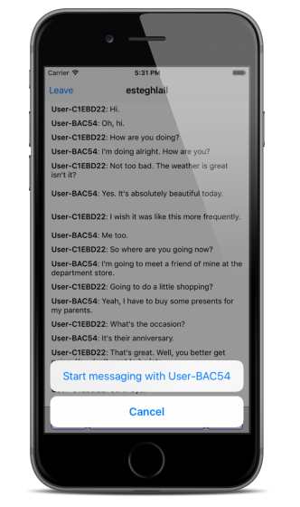
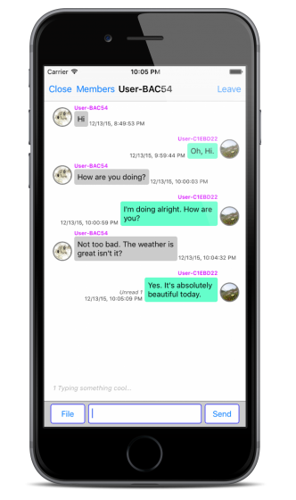

# Implement 1-on-1 Messaging

1-on-1 messaging needs two users. JIVER identifies each user with User ID. The sample project provides the feature for messaging which the user can choose another user for obtaining ID of the user in the open chat channel.

## Start messaging

You need opponent's user ID in order to start 1-on-1 messaging. Each message in open chat has the sender's user ID. We will use it for messaging.

Open **OpenChatChattingViewController.m** in Xcode.


Implement [tableView:didSelectRowAtIndexPath:](https://developer.apple.com/library/ios/documentation/UIKit/Reference/UITableViewDelegate_Protocol/#//apple_ref/occ/intfm/UITableViewDelegate/tableView:didSelectRowAtIndexPath:) for getting the user ID of the message's sender.

```objectivec
- (void)tableView:(UITableView *)tableView didSelectRowAtIndexPath:(NSIndexPath *)indexPath
{
    UIAlertController *messageSubMenu;
    UIAlertAction *messageAction;
    UIAlertAction *messageCancelAction;

    if ([[messages objectAtIndex:indexPath.row] isKindOfClass:[JiverMessage class]]) {
        JiverMessage *message = (JiverMessage *)[messages objectAtIndex:indexPath.row];
        
        if ([[[message sender] guestId] isEqualToString:[Jiver getUserId]]) {
            return;
        }
        
        NSString *actionTitle = [NSString stringWithFormat:@"Start messaging with %@", [message getSenderName]];
        messageSubMenu = [UIAlertController alertControllerWithTitle:nil message:nil preferredStyle:UIAlertControllerStyleActionSheet];
        messageAction = [UIAlertAction actionWithTitle:actionTitle style:UIAlertActionStyleDefault handler:^(UIAlertAction * _Nonnull action) {
            [Jiver startMessagingWithUserId:[[message sender] guestId]];
        }];
        messageCancelAction = [UIAlertAction actionWithTitle:@"Cancel" style:UIAlertActionStyleCancel handler:^(UIAlertAction * _Nonnull action) {}];
        [messageSubMenu addAction:messageAction];
        [messageSubMenu addAction:messageCancelAction];
        
        [self presentViewController:messageSubMenu animated:YES completion:nil];
    }
    else {
        return;
    }
}
```

You can see ```UIAlertController``` when you click other's message in the open chat like this:




If you click "Start messaging with OPPONENT_NAME", then [Jiver startMessagingWithUserId:](http://docs.jiver.co/ref/ios/en/Classes/Jiver.html#//api/name/startMessagingWithUserId:) is invoked. When it is invoked and succeeded, the callback [messagingStartedBlock:](http://docs.jiver.co/ref/ios/en/Classes/Jiver.html#//api/name/setEventHandlerConnectBlock:errorBlock:channelLeftBlock:messageReceivedBlock:systemMessageReceivedBlock:broadcastMessageReceivedBlock:fileReceivedBlock:messagingStartedBlock:messagingUpdatedBlock:messagingEndedBlock:allMessagingEndedBlock:messagingHiddenBlock:allMessagingHiddenBlock:readReceivedBlock:typeStartReceivedBlock:typeEndReceivedBlock:allDataReceivedBlock:messageDeliveryBlock:) will be invoked as well. The callback returns [JiverMessagingChannel](http://docs.jiver.co/ref/ios/en/Classes/JiverMessagingChannel.html) object, then you and the opponent can join the channel.

You should insert codes for joining the channel in [messagingStartedBlock:](http://docs.jiver.co/ref/ios/en/Classes/Jiver.html#//api/name/setEventHandlerConnectBlock:errorBlock:channelLeftBlock:messageReceivedBlock:systemMessageReceivedBlock:broadcastMessageReceivedBlock:fileReceivedBlock:messagingStartedBlock:messagingUpdatedBlock:messagingEndedBlock:allMessagingEndedBlock:messagingHiddenBlock:allMessagingHiddenBlock:readReceivedBlock:typeStartReceivedBlock:typeEndReceivedBlock:allDataReceivedBlock:messageDeliveryBlock:). Note the codes in ```messagingStartedBlock:```.
 
```objectivec
- (void)startChattingWithPreviousMessage:(BOOL)tf
{
    [Jiver loginWithUserId:[Jiver deviceUniqueID] andUserName:[MyUtils getUserName] andUserImageUrl:[MyUtils getUserProfileImage] andAccessToken:@""];
    [Jiver joinChannel:[currentChannel url]];
    [Jiver setEventHandlerConnectBlock:^(JiverChannel *channel) {
        
    } errorBlock:^(NSInteger code) {
        
    } channelLeftBlock:^(JiverChannel *channel) {
        
    } messageReceivedBlock:^(JiverMessage *message) {
        if (lastMessageTimestamp < [message getMessageTimestamp]) {
            lastMessageTimestamp = [message getMessageTimestamp];
        }
        
        if (firstMessageTimestamp > [message getMessageTimestamp]) {
            firstMessageTimestamp = [message getMessageTimestamp];
        }
        
        if ([message isPast]) {
            [messages insertObject:message atIndex:0];
        }
        else {
            [messages addObject:message];
        }
        [self scrollToBottomWithReloading:YES animated:NO];
    } systemMessageReceivedBlock:^(JiverSystemMessage *message) {
        
    } broadcastMessageReceivedBlock:^(JiverBroadcastMessage *message) {
        if (lastMessageTimestamp < [message getMessageTimestamp]) {
            lastMessageTimestamp = [message getMessageTimestamp];
        }
        
        if (firstMessageTimestamp > [message getMessageTimestamp]) {
            firstMessageTimestamp = [message getMessageTimestamp];
        }
        
        if ([message isPast]) {
            [messages insertObject:message atIndex:0];
        }
        else {
            [messages addObject:message];
        }
        [self scrollToBottomWithReloading:YES animated:NO];
    } fileReceivedBlock:^(JiverFileLink *fileLink) {
        if (lastMessageTimestamp < [fileLink getMessageTimestamp]) {
            lastMessageTimestamp = [fileLink getMessageTimestamp];
        }
        
        if (firstMessageTimestamp > [fileLink getMessageTimestamp]) {
            firstMessageTimestamp = [fileLink getMessageTimestamp];
        }
        
        if ([fileLink isPast]) {
            [messages insertObject:fileLink atIndex:0];
        }
        else {
            [messages addObject:fileLink];
        }
        [self scrollToBottomWithReloading:YES animated:NO];
    } messagingStartedBlock:^(JiverMessagingChannel *channel) {
        UIStoryboard *storyboard = [self storyboard];
        MessagingViewController *vc = [storyboard instantiateViewControllerWithIdentifier:@"MessagingViewController"];
        [vc setMessagingChannel:channel];
        [vc setDelegate:self];
        [self presentViewController:vc animated:YES completion:nil];
    } messagingUpdatedBlock:^(JiverMessagingChannel *channel) {
        
    } messagingEndedBlock:^(JiverMessagingChannel *channel) {
        
    } allMessagingEndedBlock:^{
        
    } messagingHiddenBlock:^(JiverMessagingChannel *channel) {
        
    } allMessagingHiddenBlock:^{
        
    } readReceivedBlock:^(JiverReadStatus *status) {
        
    } typeStartReceivedBlock:^(JiverTypeStatus *status) {
        
    } typeEndReceivedBlock:^(JiverTypeStatus *status) {
        
    } allDataReceivedBlock:^(NSUInteger jiverDataType, int count) {
        
    } messageDeliveryBlock:^(BOOL send, NSString *message, NSString *data, NSString *messageId) {
        
    }];
    
    if (tf) {
        [[Jiver queryMessageListInChannel:[currentChannel url]] prevWithMessageTs:LLONG_MAX andLimit:50 resultBlock:^(NSMutableArray *queryResult) {
            for (JiverMessage *message in queryResult) {
                if ([message isPast]) {
                    [messages insertObject:message atIndex:0];
                }
                else {
                    [messages addObject:message];
                }
                
                if (lastMessageTimestamp < [message getMessageTimestamp]) {
                    lastMessageTimestamp = [message getMessageTimestamp];
                }
                
                if (firstMessageTimestamp > [message getMessageTimestamp]) {
                    firstMessageTimestamp = [message getMessageTimestamp];
                }
                
            }
            [self scrollToBottomWithReloading:YES animated:NO];
            scrollLocked = NO;
            [Jiver connectWithMessageTs:LLONG_MAX];
        } endBlock:^(NSError *error) {
            
        }];
    }
    else {
        [Jiver connect];
    }
}
```

These codes get a view controller for messaging from the storyboard and is set by the channel which returned from the block. Finally, the view controller is started.

## Implement Messaging

```MessagingViewController.m``` is invoked by ```messagingStartedBlock:``` in ```OpenChatChattingViewController.m```. Open ```MessagingViewController.m``` in Xcode to implement a messaging that includes a transfering a message, a typing indicator and an unread message count. When the current channel is updated ```registerNotificationHandlerMessagingChannelUpdatedBlock:``` will be invoked, then you have to update the infomation and read status of the channel.


Modify ```viewDidLoad``` method for initialzation a messaging. 

```objectivec
- (void)viewDidLoad {
    // ...
    
    [Jiver loginWithUserId:[Jiver deviceUniqueID] andUserName:[MyUtils getUserName] andUserImageUrl:[MyUtils getUserProfileImage] andAccessToken:@""];
    [Jiver registerNotificationHandlerMessagingChannelUpdatedBlock:^(JiverMessagingChannel *channel) {
        if ([Jiver getCurrentChannel] != nil && [[Jiver getCurrentChannel] channelId] == [channel getId]) {
            [self updateMessagingChannel:channel];
        }
    }
    mentionUpdatedBlock:^(JiverMention *mention) {
       
    }];
    [Jiver setEventHandlerConnectBlock:^(JiverChannel *channel) {
        [Jiver markAsRead];
    } errorBlock:^(NSInteger code) {
        
    } channelLeftBlock:^(JiverChannel *channel) {
        
    } messageReceivedBlock:^(JiverMessage *message) {
        if (lastMessageTimestamp < [message getMessageTimestamp]) {
            lastMessageTimestamp = [message getMessageTimestamp];
        }
        
        if (firstMessageTimestamp > [message getMessageTimestamp]) {
            firstMessageTimestamp = [message getMessageTimestamp];
        }
        
        if ([message isPast]) {
            [messages insertObject:message atIndex:0];
        }
        else {
            [messages addObject:message];
        }
        [self scrollToBottomWithReloading:YES animated:NO];
        
        [Jiver markAsRead];
    } systemMessageReceivedBlock:^(JiverSystemMessage *message) {
        if (lastMessageTimestamp < [message getMessageTimestamp]) {
            lastMessageTimestamp = [message getMessageTimestamp];
        }
        
        if (firstMessageTimestamp > [message getMessageTimestamp]) {
            firstMessageTimestamp = [message getMessageTimestamp];
        }
        
        if ([message isPast]) {
            [messages insertObject:message atIndex:0];
        }
        else {
            [messages addObject:message];
        }
        [self scrollToBottomWithReloading:YES animated:NO];
        
        [Jiver markAsRead];
    } broadcastMessageReceivedBlock:^(JiverBroadcastMessage *message) {
        if (lastMessageTimestamp < [message getMessageTimestamp]) {
            lastMessageTimestamp = [message getMessageTimestamp];
        }
        
        if (firstMessageTimestamp > [message getMessageTimestamp]) {
            firstMessageTimestamp = [message getMessageTimestamp];
        }
        
        if ([message isPast]) {
            [messages insertObject:message atIndex:0];
        }
        else {
            [messages addObject:message];
        }
        [self scrollToBottomWithReloading:YES animated:NO];
        
        [Jiver markAsRead];
    } fileReceivedBlock:^(JiverFileLink *fileLink) {
        if (lastMessageTimestamp < [fileLink getMessageTimestamp]) {
            lastMessageTimestamp = [fileLink getMessageTimestamp];
        }
        
        if ([fileLink isPast]) {
            [messages insertObject:fileLink atIndex:0];
        }
        else {
            [messages addObject:fileLink];
        }
        [self scrollToBottomWithReloading:YES animated:NO];
        
        [Jiver markAsRead];
    } messagingStartedBlock:^(JiverMessagingChannel *channel) {
        currentChannel = channel;
        [self updateMessagingChannel:channel];
        
        [[Jiver queryMessageListInChannel:[currentChannel getUrl]] prevWithMessageTs:LLONG_MAX andLimit:50 resultBlock:^(NSMutableArray *queryResult) {
            for (JiverMessage *message in queryResult) {
                if ([message isPast]) {
                    [messages insertObject:message atIndex:0];
                }
                else {
                    [messages addObject:message];
                }
                
                if (lastMessageTimestamp < [message getMessageTimestamp]) {
                    lastMessageTimestamp = [message getMessageTimestamp];
                }
                
                if (firstMessageTimestamp > [message getMessageTimestamp]) {
                    firstMessageTimestamp = [message getMessageTimestamp];
                }
            }
            [self scrollToBottomWithReloading:YES animated:NO];
            [Jiver joinChannel:[currentChannel getUrl]];
            scrollLocked = NO;
            [Jiver connectWithMessageTs:LLONG_MAX];
        } endBlock:^(NSError *error) {
            
        }];
    } messagingUpdatedBlock:^(JiverMessagingChannel *channel) {
        currentChannel = channel;
        [self updateMessagingChannel:channel];
    } messagingEndedBlock:^(JiverMessagingChannel *channel) {
        
    } allMessagingEndedBlock:^{
        
    } messagingHiddenBlock:^(JiverMessagingChannel *channel) {
        
    } allMessagingHiddenBlock:^{
        
    } readReceivedBlock:^(JiverReadStatus *status) {
        [self setReadStatus:[[status user] guestId] andTimestamp:[status timestamp]];
        [self.messagingTableView reloadData];
    } typeStartReceivedBlock:^(JiverTypeStatus *status) {
        [self setTypeStatus:[[status user] guestId] andTimestamp:[status timestamp]];
        [self showTyping];
    } typeEndReceivedBlock:^(JiverTypeStatus *status) {
        [self setTypeStatus:[[status user] guestId] andTimestamp:0];
        [self showTyping];
    } allDataReceivedBlock:^(NSUInteger jiverDataType, int count) {
        
    } messageDeliveryBlock:^(BOOL send, NSString *message, NSString *data, NSString *messageId) {
        
    }];
    [Jiver joinMessagingWithChannelUrl:[currentChannel getUrl]];
}
```

We must manage the timestamp of the last message and first message. The timestamp of the last message will be used for loading next messages and the timestamp of the first message will be used for loading previous messages.

In the above code we used LLONG_MAX value for [prevWithMessageTs:](http://docs.jiver.co/ref/ios/en/Classes/JiverMessageListQuery.html#//api/name/prevWithMessageTs:andLimit:resultBlock:endBlock:). It means that the latest messages can be fetched from JIVER server. However, while we are fetching messages, new message can be added to the messaging channel. We have to get all message including it. So we invoke [[Jiver connectWithMessageTs:LLONG_MAX]](http://docs.jiver.co/ref/ios/en/Classes/Jiver.html#//api/name/connectWithMessageTs:) in ```resultBlock:```. New message will be returned in ```messageReceivedBlock:``` of ```[Jiver setEventHandlerConnectBlock:...]``` like a real-time message.

## Load previous messages

Modify ```loadPreviosMessage``` method for getting previous messages.

```objectivec
- (void) loadPreviousMessages {
    if (isLoadingMessage) {
        return;
    }
    isLoadingMessage = YES;
    
    [self.prevMessageLoadingIndicator setHidden:NO];
    [self.prevMessageLoadingIndicator startAnimating];
    [[Jiver queryMessageListInChannel:[currentChannel getUrl]] prevWithMessageTs:firstMessageTimestamp andLimit:50 resultBlock:^(NSMutableArray *queryResult) {
        NSMutableArray *newMessages = [[NSMutableArray alloc] init];
        for (JiverMessage *message in queryResult) {
            if ([message isPast]) {
                [newMessages insertObject:message atIndex:0];
            }
            else {
                [newMessages addObject:message];
            }
            
            if (lastMessageTimestamp < [message getMessageTimestamp]) {
                lastMessageTimestamp = [message getMessageTimestamp];
            }
            
            if (firstMessageTimestamp > [message getMessageTimestamp]) {
                firstMessageTimestamp = [message getMessageTimestamp];
            }
        }
        NSUInteger newMsgCount = [newMessages count];

        if (newMsgCount > 0) {
            [messages insertObjects:newMessages atIndexes:[NSIndexSet indexSetWithIndexesInRange:NSMakeRange(0, newMsgCount)]];
            
            dispatch_after(dispatch_time(DISPATCH_TIME_NOW, (int64_t)(1.0 * NSEC_PER_SEC)), dispatch_get_main_queue(), ^{
                [self.messagingTableView reloadData];
                if ([newMessages count] > 0) {
                    [self.messagingTableView scrollToRowAtIndexPath:[NSIndexPath indexPathForRow:([newMessages count] - 1) inSection:0] atScrollPosition:UITableViewScrollPositionTop animated:NO];
                }
                isLoadingMessage = NO;
                [self.prevMessageLoadingIndicator setHidden:YES];
                [self.prevMessageLoadingIndicator stopAnimating];
            });
        }
        else {
            isLoadingMessage = NO;
            [self.prevMessageLoadingIndicator setHidden:YES];
            [self.prevMessageLoadingIndicator stopAnimating];
        }
    } endBlock:^(NSError *error) {
        isLoadingMessage = NO;
        [self.prevMessageLoadingIndicator setHidden:YES];
        [self.prevMessageLoadingIndicator stopAnimating];
    }];
}
```
## Transfer a Message in Messaging

To send a message, modify ```sendMessage:``` method. This method is invoked by clicking “Send” button or pressing return key. [Jiver sendMessage:](http://docs.jiver.co/ref/ios/en/Classes/Jiver.html#//api/name/sendMessage:) method sends ```message``` immediately.

```objectivec
- (void) sendMessage
{
    NSString *message = [self.messageTextField text];
    if ([message length] > 0) {
        [self.messageTextField setText:@""];
        [Jiver sendMessage:message];
        [Jiver typeEnd];
    }
    scrollLocked = NO;
}
```

If you click **File** button, [UIImagePickerController](https://developer.apple.com/library/ios/documentation/UIKit/Reference/UIImagePickerController_Class/) will be opened by ```clickSendFileButton:``` method.

We use [UIImagePickerController](https://developer.apple.com/library/ios/documentation/UIKit/Reference/UIImagePickerController_Class/) to pick an image for sending, modify following method to this file. [Jiver uploadFile:type:hasSizeOfFile:withCustomField:uploadBlock:](http://docs.jiver.co/ref/ios/en/Classes/Jiver.html#//api/name/uploadFile:type:hasSizeOfFile:withCustomField:uploadBlock:) method uploads ```imageFileData``` to JIVER server. This method returns [JiverFileInfo](http://docs.jiver.co/ref/ios/en/Classes/JiverFileInfo.html) object and you can send this object through [Jiver sendFile:](http://docs.jiver.co/ref/ios/en/Classes/Jiver.html#//api/name/sendFile:).

```objectivec
- (void)imagePickerController:(UIImagePickerController *)picker didFinishPickingMediaWithInfo:(NSDictionary *)info
{
    __block NSString *mediaType = [info objectForKey: UIImagePickerControllerMediaType];
    __block UIImage *originalImage, *editedImage, *imageToUse;
    __block NSURL *imagePath;
    __block NSString *imageName;
    
    [picker dismissViewControllerAnimated:YES completion:^{
        if (CFStringCompare ((CFStringRef) mediaType, kUTTypeImage, 0) == kCFCompareEqualTo) {
            editedImage = (UIImage *) [info objectForKey:
                                       UIImagePickerControllerEditedImage];
            originalImage = (UIImage *) [info objectForKey:
                                         UIImagePickerControllerOriginalImage];
            
            if (originalImage) {
                imageToUse = originalImage;
            } else {
                imageToUse = editedImage;
            }
            
            NSData *imageFileData = UIImagePNGRepresentation(imageToUse);
            imagePath = [info objectForKey:@"UIImagePickerControllerReferenceURL"];
            imageName = [imagePath lastPathComponent];
            
            [Jiver uploadFile:imageFileData type:@"image/jpg" hasSizeOfFile:[imageFileData length] withCustomField:@"" uploadBlock:^(JiverFileInfo *fileInfo, NSError *error) {
                openImagePicker = NO;
                [Jiver sendFile:fileInfo];
            }];
        }
    }];
}
```

## Implement Typing Indicator

### Send Typing Status

Messaging supports a typing indicator. The typing indicator shows who is typing and how many people are typing now.

When the message is entering in UITextField, send the command to notify typing. When ```UITextField``` is empty, send the command to notify typing end.

```objectivec
- (void) textFieldDidChange:(UITextView *)textView
{
    if ([[textView text] length] > 0) {
        [Jiver typeStart];
    }
    else {
        [Jiver typeEnd];
    }
}
```

### Receive Typing Status

You can receive the typing status of other users in the same channel in callback blocks. ```[Jiver setEventHandlerConnectBlock:...``` includes the callbacks for it. 

```objectivec
    //...
    } typeStartReceivedBlock:^(JiverTypeStatus *status) {
        [self setTypeStatus:[[status user] guestId] andTimestamp:[status timestamp]];
        [self showTyping];
    } typeEndReceivedBlock:^(JiverTypeStatus *status) {
        [self setTypeStatus:[[status user] guestId] andTimestamp:0];
        [self showTyping];
    }
    //...
```

We always have to consider the network problem. The command to notify typing end can be lost, so you need to implement a timer for dealing with it. The timer will remove the indicator after 10 seconds even if the command to notify typind end is not receieved.

```objectivec
- (void)startTimer
{
    if (typingIndicatorTimer != nil) {
        [typingIndicatorTimer invalidate];
    }

    typingIndicatorTimer = [NSTimer scheduledTimerWithTimeInterval:10 target:self selector:@selector(clearTypingIndicator:) userInfo:nil repeats:NO];
}

- (void)clearTypingIndicator:(NSTimer *)timer
{
    [self hideTyping];
}
```

```objectivec
- (void) showTyping
{
    if ([typeStatus count] == 0) {
        [self hideTyping];
    }
    else {
        [self.typingIndicatorView setHidden:NO];
        [self.typeStatusLabel setHidden:NO];
        self.typingIndicatorHeight.constant = 48;
        [self.view updateConstraints];
        
        [self scrollToBottomWithReloading:NO animated:NO];
        
        [self.typeStatusLabel setText:[MyUtils generateTypingStatus:typeStatus]];
    }
    [self startTimer];
}
```

The typing indicator will be on the bottom of the message table view.


## Manage Unread Count on Each Message

### Send Mark As Read

To display the unread count on opponents, you have to send mark as read command whenever you received messages.

```objectivec
[Jiver setEventHandlerConnectBlock:^(JiverChannel *channel) {
        [Jiver markAsRead];
    } errorBlock:^(NSInteger code) {
        
    } channelLeftBlock:^(JiverChannel *channel) {
        
    } messageReceivedBlock:^(JiverMessage *message) {
        // ...
        [Jiver markAsRead];
    } systemMessageReceivedBlock:^(JiverSystemMessage *message) {
        // ...
        [Jiver markAsRead];
    } broadcastMessageReceivedBlock:^(JiverBroadcastMessage *message) {
        // ...
        [Jiver markAsRead];
    } fileReceivedBlock:^(JiverFileLink *fileLink) {
        // ...
        [Jiver markAsRead];
    } messagingStartedBlock:^(JiverMessagingChannel *channel) {
        // ...
    } messagingUpdatedBlock:^(JiverMessagingChannel *channel) {
        // ...
    } messagingEndedBlock:^(JiverMessagingChannel *channel) {
        // ...
    } allMessagingEndedBlock:^{
        // ...
    } messagingHiddenBlock:^(JiverMessagingChannel *channel) {
        // ...
    } allMessagingHiddenBlock:^{
        // ...
    } readReceivedBlock:^(JiverReadStatus *status) {
        // ...
    } typeStartReceivedBlock:^(JiverTypeStatus *status) {
        // ...
    } typeEndReceivedBlock:^(JiverTypeStatus *status) {
        // ...
    } allDataReceivedBlock:^(NSUInteger jiverDataType, int count) {
        // ...
    } messageDeliveryBlock:^(BOOL send, NSString *message, NSString *data, NSString *messageId) {
        // ...
    }];
```

### Display Unread Count

When opponents send you mark as read command, it is returned in ```readReceivedBlock:``` callback in ```[Jiver setEventHandlerConnectBlock:...]```. 

```objectivec
[Jiver setEventHandlerConnectBlock:^(JiverChannel *channel) {
        // ...
    } errorBlock:^(NSInteger code) {
        // ...
    } channelLeftBlock:^(JiverChannel *channel) {
        // ...
    } messageReceivedBlock:^(JiverMessage *message) {
        // ...
    } systemMessageReceivedBlock:^(JiverSystemMessage *message) {
        // ...
    } broadcastMessageReceivedBlock:^(JiverBroadcastMessage *message) {
        // ...
    } fileReceivedBlock:^(JiverFileLink *fileLink) {
        // ...
    } messagingStartedBlock:^(JiverMessagingChannel *channel) {
        // ...
    } messagingUpdatedBlock:^(JiverMessagingChannel *channel) {
        // ...
    } messagingEndedBlock:^(JiverMessagingChannel *channel) {
        // ...
    } allMessagingEndedBlock:^{
        // ...
    } messagingHiddenBlock:^(JiverMessagingChannel *channel) {
        // ...
    } allMessagingHiddenBlock:^{
        // ...
    } readReceivedBlock:^(JiverReadStatus *status) {
        [self setReadStatus:[[status user] guestId] andTimestamp:[status timestamp]];
        [self.messagingTableView reloadData];
    } typeStartReceivedBlock:^(JiverTypeStatus *status) {
        // ...
    } typeEndReceivedBlock:^(JiverTypeStatus *status) {
        // ...
    } allDataReceivedBlock:^(NSUInteger jiverDataType, int count) {
        // ...
    } messageDeliveryBlock:^(BOOL send, NSString *message, NSString *data, NSString *messageId) {
        // ...
    }];
```

If you received the mark as read command, update read status of the current channel and reload message table view with it.

```objectivec
- (void) setReadStatus:(NSString *)userId andTimestamp:(long long)ts
{
    if (readStatus == nil) {
        readStatus = [[NSMutableDictionary alloc] init];
    }
    
    if ([readStatus objectForKey:userId] == nil) {
        [readStatus setObject:[NSNumber numberWithLongLong:ts] forKey:userId];
    }
    else {
        long long oldTs = [[readStatus objectForKey:userId] longLongValue];
        if (oldTs < ts) {
            [readStatus setObject:[NSNumber numberWithLongLong:ts] forKey:userId];
        }
    }
}
```

When the current channel is updated by ```registerNotificationHandlerMessagingChannelUpdatedBlock:mentionUpdatedBlock:```, you have to update the read status of the channel. The following method is invoked in ```registerNotificationHandlerMessagingChannelUpdatedBlock:``` callback.

```objectivec
- (void) updateMessagingChannel:(JiverMessagingChannel *)channel
{
    [self.navigationBarTitle setTitle:[MyUtils generateMessagingTitle:currentChannel]];
    
    NSMutableDictionary *newReadStatus = [[NSMutableDictionary alloc] init];
    for (JiverMemberInMessagingChannel *member in [channel members]) {
        NSNumber *currentStatus = [readStatus objectForKey:[member guestId]];
        if (currentStatus == nil) {
            currentStatus = [NSNumber numberWithLongLong:0];
        }
        [newReadStatus setObject:[NSNumber numberWithLongLong:MAX([currentStatus longLongValue], [channel getLastReadMillis:[member guestId]])] forKey:[member guestId]];
    }
    
    if (readStatus == nil) {
        readStatus = [[NSMutableDictionary alloc] init];
    }
    [readStatus removeAllObjects];
    for (NSString *key in newReadStatus) {
        id value = [newReadStatus objectForKey:key];
        [readStatus setObject:value forKey:key];
    }
    [self.messagingTableView reloadData];
}
```

If you implemented all of the read status, you can see the unread count on each message.



## Implement Messaging List

Each user has the list of messaging channels which joined. We will show it on Messaging Tab.

Open ```MessagingChannelListViewController.m``` in Xcode.


The messaging channel list will be updated when each channel is updated. Each channel item of the list includes the title which is consist of members' name, the number of members, the last message in the channel, the date of the last message and the unread message count.

```startJiver``` method is invoked when the messaging tab is selected and ```prepareCloseMessagingViewController``` of ```MessagingViewControllerDelegate``` and ```prepareCloseMessagingInviteSelectChannelViewController``` of ```MessagingInviteSelectChannelViewControllerDelegate``` are invoked. ```registerNotificationHandlerMessagingChannelUpdatedBlock``` callback returns updated messaging channel, so you have to update the channel which is returned.

```objectivec
- (void) startJiver
{
    [Jiver loginWithUserId:[Jiver deviceUniqueID] andUserName:[MyUtils getUserName] andUserImageUrl:[MyUtils getUserProfileImage] andAccessToken:@""];
    [Jiver registerNotificationHandlerMessagingChannelUpdatedBlock:^(JiverMessagingChannel *channel) {
        for (JiverMessagingChannel *oldChannel in channelArray) {
            if ([oldChannel getId] == [channel getId]) {
                [channelArray removeObject:oldChannel];
                break;
            }
        }
        [channelArray insertObject:channel atIndex:0];
        [self.messagingChannelListTableView reloadData];
    }
    mentionUpdatedBlock:^(JiverMention *mention) {

    }];
    
    dispatch_after(dispatch_time(DISPATCH_TIME_NOW, (int64_t)(0.1 * NSEC_PER_SEC)), dispatch_get_main_queue(), ^{
        messagingChannelListQuery = [Jiver queryMessagingChannelList];
        [messagingChannelListQuery setLimit:15];
        if ([messagingChannelListQuery hasNext]) {
            [messagingChannelListQuery nextWithResultBlock:^(NSMutableArray *queryResult) {
                [channelArray removeAllObjects];
                [channelArray addObjectsFromArray:queryResult];
                [self.messagingChannelListTableView reloadData];
            } endBlock:^(NSInteger code) {
                
            }];
        }
        [Jiver joinChannel:@""];
        [Jiver connect];
    });
}
```

When the channel is clicked ```MessagingViewController``` have to be opened.

```objectivec
- (void)tableView:(UITableView *)tableView didSelectRowAtIndexPath:(NSIndexPath *)indexPath
{
    JiverMessagingChannel *channel = (JiverMessagingChannel *)[channelArray objectAtIndex:[indexPath row]];
    
    UIStoryboard *storyboard = [self storyboard];
    MessagingViewController *vc = [storyboard instantiateViewControllerWithIdentifier:@"MessagingViewController"];
    [vc setMessagingChannel:channel];
    [vc setDelegate:self];
    [self presentViewController:vc animated:YES completion:nil];
}
```


