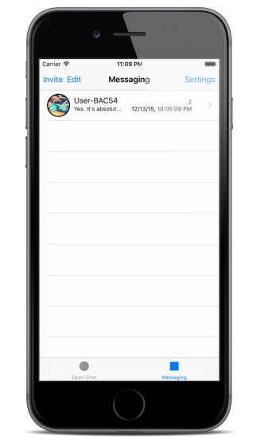
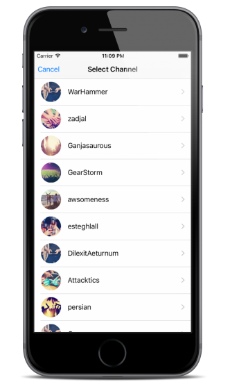
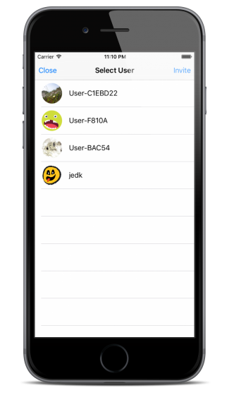
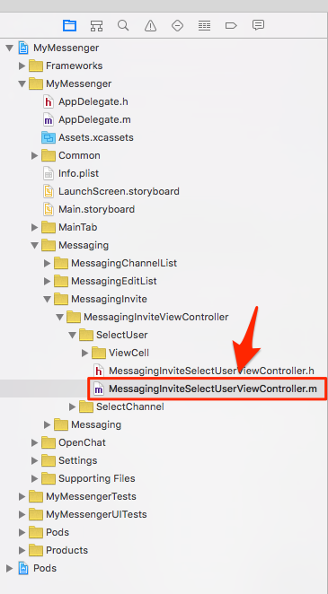

# Implement Group Messaging

Group messaging is the extened concept of the 1-on-1 messaging. It has the feature for inviting users, typing indicator and unread message count.

Three or more users is required in order to start group messaging. The sample project provides the feature for it in Messaging tab.

You can select users who you want to invite in Messaging **Tab > Invite > Select Channel > Select User**. 

  

## Invite Users

