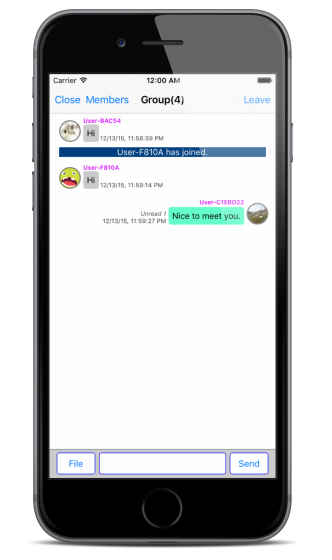

!REDIRECT "https://sendbird.gitbooks.io/how-to-build-an-ios-messaging-app/content/en/implement_group_messaging.html"

# Implement Group Messaging

Group messaging is an extended concept of 1-on-1 messaging. It also comes with features for inviting users, a typing indicator and an unread message count.

Three or more users are required in order to start a group messaging. The sample project provides these feature for it in a Messaging Tab.

You can select users you want to invite in **Messaging Tab > Invite > Select Channel > Select User**. 

  


## Invite Users

Open ```MessagingInviteSelectUserViewController.m`` in Xcode to implement invitation.


The callback block is required to get the messaging channel after inviting users. The ```messagingStartedBlock:``` will be invoked after the invitation. You should insert the lines of code to open ```MessagingViewController``` here.

```objectivec
- (void)viewDidLoad {
    // ...
    
    [Inteage loginWithUserId:[Inteage deviceUniqueID] andUserName:[MyUtils getUserName] andUserImageUrl:[MyUtils getUserProfileImage] andAccessToken:@""];
    memberListQuery = [Inteage queryMemberListInChannel:[selectedChannel url]];
    [memberListQuery nextWithResultBlock:^(NSMutableArray *queryResult) {
        for (InteageMember *user in queryResult) {
            [userArray addObject:user];
        }
        [self.messagingInviteSelectUserTableView reloadData];
    } endBlock:^(NSError *error) {

    }];
    [Inteage setEventHandlerConnectBlock:^(InteageChannel *channel) {
        
    } errorBlock:^(NSInteger code) {
        
    } channelLeftBlock:^(InteageChannel *channel) {
        
    } messageReceivedBlock:^(InteageMessage *message) {
        
    } systemMessageReceivedBlock:^(InteageSystemMessage *message) {
        
    } broadcastMessageReceivedBlock:^(InteageBroadcastMessage *message) {
        
    } fileReceivedBlock:^(InteageFileLink *fileLink) {
        
    } messagingStartedBlock:^(InteageMessagingChannel *channel) {
        UIStoryboard *storyboard = [self storyboard];
        MessagingViewController *vc = [storyboard instantiateViewControllerWithIdentifier:@"MessagingViewController"];
        [vc setMessagingChannel:channel];
        [vc setDelegate:self];
        [self presentViewController:vc animated:YES completion:nil];
    } messagingUpdatedBlock:^(InteageMessagingChannel *channel) {
        
    } messagingEndedBlock:^(InteageMessagingChannel *channel) {
        
    } allMessagingEndedBlock:^{
        
    } messagingHiddenBlock:^(InteageMessagingChannel *channel) {
        
    } allMessagingHiddenBlock:^{
        
    } readReceivedBlock:^(InteageReadStatus *status) {
        
    } typeStartReceivedBlock:^(InteageTypeStatus *status) {
        
    } typeEndReceivedBlock:^(InteageTypeStatus *status) {
        
    } allDataReceivedBlock:^(NSUInteger inteageDataType, int count) {
        
    } messageDeliveryBlock:^(BOOL send, NSString *message, NSString *data, NSString *messageId) {
        
    }];
}
```

You have to modify ```inviteUsers:``` method in order to invite multiple users.

```objectivec
- (IBAction)inviteUsers:(id)sender {
    NSArray * indexPaths = [self.messagingInviteSelectUserTableView indexPathsForSelectedRows];
    NSMutableArray<NSString *> *userIds = [[NSMutableArray alloc] init];
    for (NSIndexPath *indexPath in indexPaths) {
        [userIds addObject:[[userArray objectAtIndex:indexPath.row] guestId]];
    }
    
    if ([userIds count] > 0) {
        [Inteage startMessagingWithUserIds:userIds];
    }
}
```

Other features are equivalent to those for 1-on-1 messaging.




