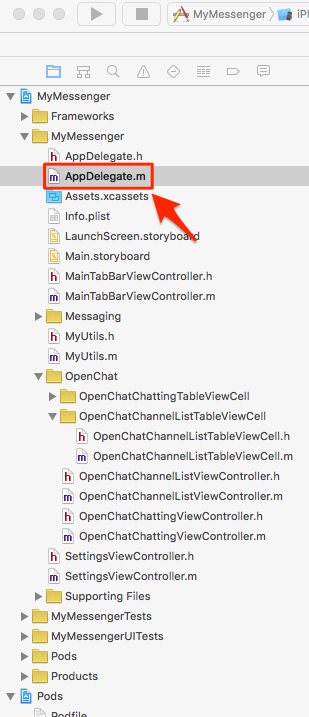
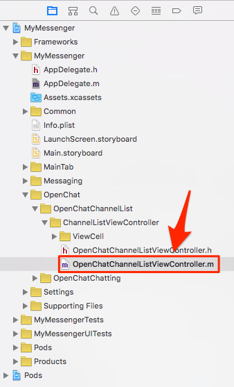
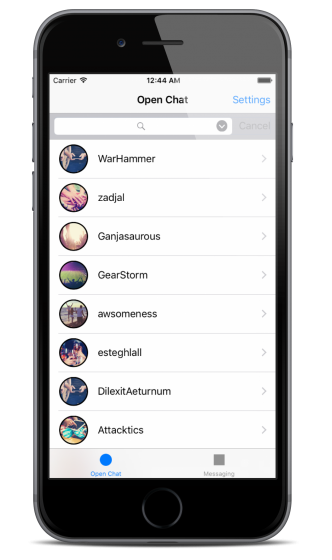
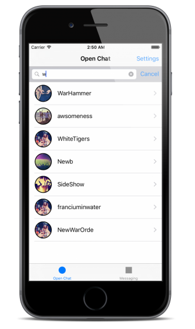
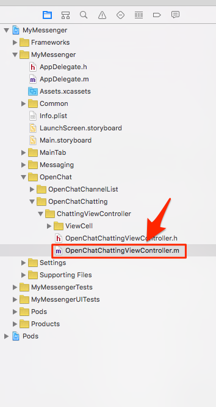
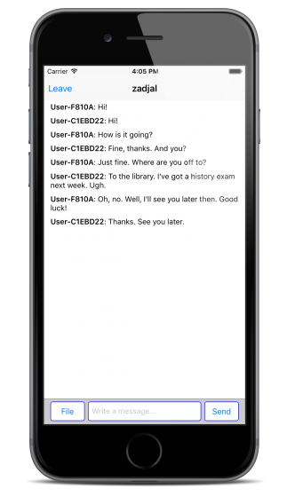

# Implement Open Chat

## Create Channels on JIVER Dashboard

You have to create channels in order to implement open chat in your application.

1. Sign in at [JIVER Dashboard](https://dashboard.jiver.co).
2. Select **APPLICATION** on the side menu and click on your app.
3. Click **CHANNELS** tab.
4. Click **CREATE CHANNEL** button.
5. Fill up the form to create the channel you want.
6. Click **CREATE** button.

 
## Initialize JIVER Framework

Open the sample project and **AppDelegate.m** in Xcode.



Initialize JIVER framework in ```application:didFinishLaunchingWithOptions:```

```objectivec
- (BOOL)application:(UIApplication *)application didFinishLaunchingWithOptions:(NSDictionary *)launchOptions {
    // Override point for customization after application launch.
    [Jiver initAppId:@"<YOUR_APP_ID>"];
    
    return YES;
}
```
 
## Implement Channel Loading

Open **OpenChatChannelListViewController.m** in Xcode.



Add [JiverChannelListQuery](http://docs.jiver.co/ref/ios/en/Classes/JiverChannelListQuery.html) object for querying the channels.

```objectivec
@interface OpenChatChannelListViewController ()<UITableViewDataSource, UITableViewDelegate, UISearchBarDelegate> {
    NSMutableArray *channelArray;
    BOOL isLoadingChannel;
    JiverChannelListQuery *channelListQuery;
}
```

Insert the following code to log in and query the channels at the bottom of ```viewDidLoad``` method.

```objectivec
- (void)viewDidLoad {
    [super viewDidLoad];
    // Do any additional setup after loading the view, typically from a nib.
    
    isLoadingChannel = NO;
    
    [self.openChatChannelListTableView setContentInset:UIEdgeInsetsMake(108, 0, 48, 0)];
    [self.openChatChannelListTableView setDelegate:self];
    [self.openChatChannelListTableView setDataSource:self];
    
    [self.channelSearchBar setDelegate:self];
    
    channelArray = [[NSMutableArray alloc] init];
    
    [self.openChatChannelListLoadingIndicator setHidden:YES];

    [Jiver loginWithUserId:[Jiver deviceUniqueID] andUserName:[MyUtils getUserName] andUserImageUrl:[MyUtils getUserProfileImage] andAccessToken:@""];
    channelListQuery = [Jiver queryChannelList];
    [channelListQuery nextWithResultBlock:^(NSMutableArray *queryResult) {
        for (JiverChannel *channel in queryResult) {
            [channelArray addObject:channel];
        }
        [self.openChatChannelListTableView reloadData];
    } endBlock:^(NSError *error) {

    }];
}
```

**User ID** is used to identify users in your application. This project uses device ID(IDFV) as **User ID**. If there isn’t the user which has the user ID, JIVER will generate one.

Channel queries support pagination. Let’s try it out.

The ```loadNextChannelList``` method will be invoked when the ```UITableView``` for channels draws the last row. If you scroll to the bottom of the ```UITableView```, the next page of channels will be fetched from JIVER server and attached at the bottom of the ```UITableView```.

Modify ```loadNextChannelList``` like this:

```objectivec
- (void)loadNextChannelList
{    
    if (![channelListQuery hasNext]) {
        return;
    }
    
    if (isLoadingChannel) {
        return;
    }
    isLoadingChannel = YES;
    
    [channelListQuery nextWithResultBlock:^(NSMutableArray *queryResult) {
        for (JiverChannel *channel in queryResult) {
            [channelArray addObject:channel];
        }
        [self.openChatChannelListTableView reloadData];
        isLoadingChannel = NO;
    } endBlock:^(NSError *error) {
        
    }];
}
```

## Channel Search

JIVER supports channel search which is implemented at ```UISearchBar``` in the sample project.

Modify [searchBarSearchButtonClicked:](https://developer.apple.com/library/ios/documentation/UIKit/Reference/UISearchBarDelegate_Protocol/index.html#//apple_ref/occ/intfm/UISearchBarDelegate/searchBarSearchButtonClicked:) to query with a keyword and [searchBarCancelButtonClicked:](https://developer.apple.com/library/ios/documentation/UIKit/Reference/UISearchBarDelegate_Protocol/index.html#//apple_ref/occ/intfm/UISearchBarDelegate/searchBarCancelButtonClicked:) to clear the result.

```objectivec
- (void)searchBarCancelButtonClicked:(UISearchBar *)searchBar
{
    [channelArray removeAllObjects];
    [searchBar setText:@""];
    channelListQuery = [Jiver queryChannelList];
    [channelListQuery setQuery:@""];
    [channelListQuery nextWithResultBlock:^(NSMutableArray *queryResult) {
        for (JiverChannel *channel in queryResult) {
            [channelArray addObject:channel];
        }
        [self.openChatChannelListTableView reloadData];
    } endBlock:^(NSError *error) {
        
    }];
}

- (void)searchBarSearchButtonClicked:(UISearchBar *)searchBar
{
    [channelArray removeAllObjects];
    channelListQuery = [Jiver queryChannelList];
    [channelListQuery setQuery:[searchBar text]];
    [channelListQuery nextWithResultBlock:^(NSMutableArray *queryResult) {
        for (JiverChannel *channel in queryResult) {
            [channelArray addObject:channel];
        }
        [self.openChatChannelListTableView reloadData];
    } endBlock:^(NSError *error) {
        
    }];
}
```

If you run the sample project, you can see the channels you created on the JIVER Dashboard.

 

## Transfer a Message in Open Chat

Open **OpenChatChattingViewController.m** in Xcode.



The user interface for the chat consists of ```UITableView``` for messages, ```UIButton``` for sending an image, ```UITextField``` for entering a message and ```UIButton``` for sending a message. 

Modify ```startChattingWithPreviousMessage:``` method. This method is used when the chat starts. If you want to get previous messages when started, pass ```YES```. Otherwise, pass ```NO```.

```objectivec
- (void)startChattingWithPreviousMessage:(BOOL)tf
{
    [Jiver loginWithUserId:[Jiver deviceUniqueID] andUserName:[MyUtils getUserName] andUserImageUrl:[MyUtils getUserProfileImage] andAccessToken:@""];
    [Jiver joinChannel:[currentChannel url]];
    [Jiver setEventHandlerConnectBlock:^(JiverChannel *channel) {
        
    } errorBlock:^(NSInteger code) {
        
    } channelLeftBlock:^(JiverChannel *channel) {
        
    } messageReceivedBlock:^(JiverMessage *message) {
        if (lastMessageTimestamp < [message getMessageTimestamp]) {
            lastMessageTimestamp = [message getMessageTimestamp];
        }
        
        if (firstMessageTimestamp > [message getMessageTimestamp]) {
            firstMessageTimestamp = [message getMessageTimestamp];
        }
        
        if ([message isPast]) {
            [messages insertObject:message atIndex:0];
        }
        else {
            [messages addObject:message];
        }
        [self scrollToBottomWithReloading:YES animated:NO];
    } systemMessageReceivedBlock:^(JiverSystemMessage *message) {
        
    } broadcastMessageReceivedBlock:^(JiverBroadcastMessage *message) {
        if (lastMessageTimestamp < [message getMessageTimestamp]) {
            lastMessageTimestamp = [message getMessageTimestamp];
        }
        
        if (firstMessageTimestamp > [message getMessageTimestamp]) {
            firstMessageTimestamp = [message getMessageTimestamp];
        }
        
        if ([message isPast]) {
            [messages insertObject:message atIndex:0];
        }
        else {
            [messages addObject:message];
        }
        [self scrollToBottomWithReloading:YES animated:NO];
    } fileReceivedBlock:^(JiverFileLink *fileLink) {
        if (lastMessageTimestamp < [fileLink getMessageTimestamp]) {
            lastMessageTimestamp = [fileLink getMessageTimestamp];
        }
        
        if (firstMessageTimestamp > [fileLink getMessageTimestamp]) {
            firstMessageTimestamp = [fileLink getMessageTimestamp];
        }
        
        if ([fileLink isPast]) {
            [messages insertObject:fileLink atIndex:0];
        }
        else {
            [messages addObject:fileLink];
        }
        [self scrollToBottomWithReloading:YES animated:NO];
    } messagingStartedBlock:^(JiverMessagingChannel *channel) {
        UIStoryboard *storyboard = [self storyboard];
        MessagingViewController *vc = [storyboard instantiateViewControllerWithIdentifier:@"MessagingViewController"];
        [vc setMessagingChannel:channel];
        [vc setDelegate:self];
        [self presentViewController:vc animated:YES completion:nil];
    } messagingUpdatedBlock:^(JiverMessagingChannel *channel) {
        
    } messagingEndedBlock:^(JiverMessagingChannel *channel) {
        
    } allMessagingEndedBlock:^{
        
    } messagingHiddenBlock:^(JiverMessagingChannel *channel) {
        
    } allMessagingHiddenBlock:^{
        
    } readReceivedBlock:^(JiverReadStatus *status) {
        
    } typeStartReceivedBlock:^(JiverTypeStatus *status) {
        
    } typeEndReceivedBlock:^(JiverTypeStatus *status) {
        
    } allDataReceivedBlock:^(NSUInteger jiverDataType, int count) {
        
    } messageDeliveryBlock:^(BOOL send, NSString *message, NSString *data, NSString *messageId) {
        
    }];
    
    if (tf) {
        [[Jiver queryMessageListInChannel:[currentChannel url]] prevWithMessageTs:LLONG_MAX andLimit:50 resultBlock:^(NSMutableArray *queryResult) {
            for (JiverMessage *message in queryResult) {
                if ([message isPast]) {
                    [messages insertObject:message atIndex:0];
                }
                else {
                    [messages addObject:message];
                }
                
                if (lastMessageTimestamp < [message getMessageTimestamp]) {
                    lastMessageTimestamp = [message getMessageTimestamp];
                }
                
                if (firstMessageTimestamp > [message getMessageTimestamp]) {
                    firstMessageTimestamp = [message getMessageTimestamp];
                }
                
            }
            [self scrollToBottomWithReloading:YES animated:NO];
            scrollLocked = NO;
            [Jiver connectWithMessageTs:LLONG_MAX];
        } endBlock:^(NSError *error) {
            
        }];
    }
    else {
        [Jiver connect];
    }
}
```

There are many blocks in this code. See this [link](http://docs.jiver.co/ref/ios/en/Classes/Jiver.html#//api/name/setEventHandlerConnectBlock:errorBlock:channelLeftBlock:messageReceivedBlock:systemMessageReceivedBlock:broadcastMessageReceivedBlock:fileReceivedBlock:messagingStartedBlock:messagingUpdatedBlock:messagingEndedBlock:allMessagingEndedBlock:messagingHiddenBlock:allMessagingHiddenBlock:readReceivedBlock:typeStartReceivedBlock:typeEndReceivedBlock:allDataReceivedBlock:messageDeliveryBlock:) for detail.

Insert following code to start the open chat into the bottom of ```viewDidLoad``` method.

```objectivec
- (void)viewDidLoad {
    //...
    
    [self startChattingWithPreviousMessage:YES];
}
```

To send a message, modify ```sendMessage``` method. This method is invoked by clicking “Send” button or pressing return key. [Jiver sendMessage:](http://docs.jiver.co/ref/ios/en/Classes/Jiver.html#//api/name/sendMessage:) method sends ```message``` immediately.

```objectivec
- (void) sendMessage
{
    NSString *message = [self.messageTextField text];
    if ([message length] > 0) {
        [self.messageTextField setText:@""];
        [Jiver sendMessage:message];
    }
    scrollLocked = NO;
}
```

If you click **File** button, [UIImagePickerController](https://developer.apple.com/library/ios/documentation/UIKit/Reference/UIImagePickerController_Class/) will be opened by ```clickSendFileButton:``` method.

We use [UIImagePickerController](https://developer.apple.com/library/ios/documentation/UIKit/Reference/UIImagePickerController_Class/) to pick an image for sending, modify following method to this file. [Jiver uploadFile:type:hasSizeOfFile:withCustomField:uploadBlock:](http://docs.jiver.co/ref/ios/en/Classes/Jiver.html#//api/name/uploadFile:type:hasSizeOfFile:withCustomField:uploadBlock:) method uploads ```imageFileData``` to JIVER server. This method returns [JiverFileInfo](http://docs.jiver.co/ref/ios/en/Classes/JiverFileInfo.html) object and you can send this object through [Jiver sendFile:](http://docs.jiver.co/ref/ios/en/Classes/Jiver.html#//api/name/sendFile:).

```objectivec
- (void)imagePickerController:(UIImagePickerController *)picker didFinishPickingMediaWithInfo:(NSDictionary *)info
{
    __block NSString *mediaType = [info objectForKey: UIImagePickerControllerMediaType];
    __block UIImage *originalImage, *editedImage, *imageToUse;
    __block NSURL *imagePath;
    __block NSString *imageName;
    
    [picker dismissViewControllerAnimated:YES completion:^{
        if (CFStringCompare ((CFStringRef) mediaType, kUTTypeImage, 0) == kCFCompareEqualTo) {
            editedImage = (UIImage *) [info objectForKey:
                                       UIImagePickerControllerEditedImage];
            originalImage = (UIImage *) [info objectForKey:
                                         UIImagePickerControllerOriginalImage];
            
            if (originalImage) {
                imageToUse = originalImage;
            } else {
                imageToUse = editedImage;
            }
            
            NSData *imageFileData = UIImagePNGRepresentation(imageToUse);
            imagePath = [info objectForKey:@"UIImagePickerControllerReferenceURL"];
            imageName = [imagePath lastPathComponent];
            
            [Jiver uploadFile:imageFileData type:@"image/jpg" hasSizeOfFile:[imageFileData length] withCustomField:@"" uploadBlock:^(JiverFileInfo *fileInfo, NSError *error) {
                openImagePicker = NO;
                [Jiver sendFile:fileInfo];
            }];
        }
    }];
}
```

## Load Previous Messages

To see previous messages in the channel, implement ```loadPreviousMessages``` method. This method will be invoked when ```openChatChattingTableView`` draws the first cell. 

```objectivec
- (void) loadPreviousMessages {
    if (isLoadingMessage) {
        return;
    }
    isLoadingMessage = YES;

    [self.prevMessageLoadingIndicator setHidden:NO];
    [self.prevMessageLoadingIndicator startAnimating];
    [[Jiver queryMessageListInChannel:[currentChannel url]] prevWithMessageTs:firstMessageTimestamp andLimit:50 resultBlock:^(NSMutableArray *queryResult) {
        NSMutableArray *newMessages = [[NSMutableArray alloc] init];
        for (JiverMessage *message in queryResult) {
            if ([message isPast]) {
                [newMessages insertObject:message atIndex:0];
            }
            else {
                [newMessages addObject:message];
            }
            
            if (lastMessageTimestamp < [message getMessageTimestamp]) {
                lastMessageTimestamp = [message getMessageTimestamp];
            }
            
            if (firstMessageTimestamp > [message getMessageTimestamp]) {
                firstMessageTimestamp = [message getMessageTimestamp];
            }
        }
        NSUInteger newMsgCount = [newMessages count];
        
        if (newMsgCount > 0) {
            [messages insertObjects:newMessages atIndexes:[NSIndexSet indexSetWithIndexesInRange:NSMakeRange(0, newMsgCount)]];
            dispatch_after(dispatch_time(DISPATCH_TIME_NOW, (int64_t)(1.0 * NSEC_PER_SEC)), dispatch_get_main_queue(), ^{
                [self.openChatChattingTableView reloadData];
                if ([newMessages count] > 0) {
                    [self.openChatChattingTableView scrollToRowAtIndexPath:[NSIndexPath indexPathForRow:([newMessages count] - 1) inSection:0] atScrollPosition:UITableViewScrollPositionTop animated:NO];
                }
                isLoadingMessage = NO;
                [self.prevMessageLoadingIndicator setHidden:YES];
                [self.prevMessageLoadingIndicator stopAnimating];
            });
        }
        else {
            isLoadingMessage = NO;
            [self.prevMessageLoadingIndicator setHidden:YES];
            [self.prevMessageLoadingIndicator stopAnimating];
        }
    } endBlock:^(NSError *error) {
        isLoadingMessage = NO;
        [self.prevMessageLoadingIndicator setHidden:YES];
        [self.prevMessageLoadingIndicator stopAnimating];
    }];
}
```

## Run Sample Project

Build the project, join a channel and send a message. You need two devices or one device and iOS simulator for testing. If you don’t have a real device, you can use **OPERATIONS** on **JIVER Dashboard** to chat with an iOS simulator.
 
