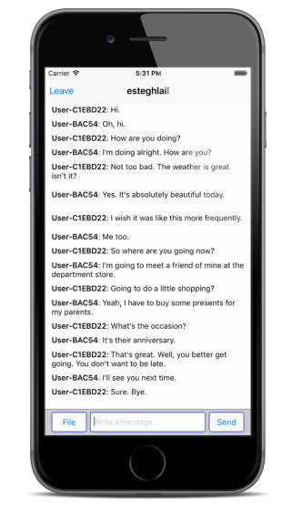

# Implement Open Chat

## Create the channels on JIVER Dashboard

You have to prepare channels for open chat in your application in order to implement open chat.

1. Sign in [JIVER Dashboard](https://dashboard.jiver.co).
2. Select **APPLICATION** on the side menu and click your app.
3. Click **CHANNELS** tab.
4. Click **CREATE CHANNEL** button.
5. Fill up the form about the channel you want to create.
6. Click **CREATE** button.

 
## Initialize JIVER framework

Open the sample project and **AppDelegate.m** in Xcode.


Initialize JIVER framework in ```application:didFinishLaunchingWithOptions:```

```objectivec
- (BOOL)application:(UIApplication *)application didFinishLaunchingWithOptions:(NSDictionary *)launchOptions {
    // Override point for customization after application launch.
    [Jiver initAppId:@"<YOUR_APP_ID>"];
    
    return YES;
}
```

## Implement channel loading

Open the sample project and **OpenChatChannelListViewController.m** in Xcode.


Add [JiverChannelListQuery](http://docs.jiver.co/ref/ios/en/Classes/JiverChannelListQuery.html) object for querying the channels.

```objectivec
@interface OpenChatChannelListViewController ()<UITableViewDataSource, UITableViewDelegate, UIImagePickerControllerDelegate> {
    NSMutableArray *channelArray;
    BOOL isLoadingChannel;
    JiverChannelListQuery *channelListQuery;
}
```

Insert following code to log in and query the channels into the bottom of ```viewDidLoad``` method.

```objectivec
- (void)viewDidLoad {
    [super viewDidLoad];
    // Do any additional setup after loading the view, typically from a nib.
    
    //...

    [Jiver loginWithUserId:[Jiver deviceUniqueID] andUserName:[MyUtils getUserName] andUserImageUrl:[MyUtils getUserProfileImage] andAccessToken:@""];
    channelListQuery = [Jiver queryChannelList];
    [channelListQuery nextWithResultBlock:^(NSMutableArray *queryResult) {
        for (JiverChannel *channel in queryResult) {
            [channelArray addObject:channel];
        }
        [self.openChatChannelListTableView reloadData];
    } endBlock:^(NSError *error) {

    }];
}
```

**User ID** is used for identifying each user in your application. This sample project uses the device ID(IDFV) for it. If there isn’t the user which has the user ID, JIVER will create the user with the ID.

Querying channels supports a pagination. Let’s implement the pagination.

```loadNextChannelList``` method will be invoked when the ```UITableView``` for channels draws the last row. If you scroll to the bottom of the ```UITableView```, the next page of channels will be fetched from JIVER server and attached to the bottom of the ```UITableView```.

Modify ```loadNextChannelList``` like this:

```objectivec
- (void)loadNextChannelList
{    
    if (![channelListQuery hasNext]) {
        return;
    }
    
    if (isLoadingChannel) {
        return;
    }
    isLoadingChannel = YES;

    [channelListQuery nextWithResultBlock:^(NSMutableArray *queryResult) {
        for (JiverChannel *channel in queryResult) {
            [channelArray addObject:channel];
        }
        [self.openChatChannelListTableView reloadData];

        isLoadingChannel = NO;
    } endBlock:^(NSError *error) {
        
    }];
}
```

If you run the sample project, you can see the channels which you create on the dashboard.


## Transfer a Message in Open Chat

Open **OpenChatChattingViewController.m** in Xcode.


The UI for chat is consist of ```UITableView``` for messages, ```UIButton``` for sending an image, ```UITextField``` for entering a message and ```UIButton``` for sending a message. 

Insert following code to log in and query the channel list into the bottom of ```viewDidLoad``` method.

```objectivec
- (void)viewDidLoad {
    [super viewDidLoad];
    // Do any additional setup after loading the view.
    
    …

    [Jiver loginWithUserId:[Jiver deviceUniqueID] andUserName:[MyUtils getUserName] andUserImageUrl:[MyUtils getUserProfileImage] andAccessToken:@""];
    [Jiver joinChannel:[channel url]];
    [Jiver setEventHandlerConnectBlock:^(JiverChannel *channel) {
        
    } errorBlock:^(NSInteger code) {
        
    } channelLeftBlock:^(JiverChannel *channel) {
        
    } messageReceivedBlock:^(JiverMessage *message) {
        if (lastMessageTimestamp < [message getMessageTimestamp]) {
            lastMessageTimestamp = [message getMessageTimestamp];
        }
        
        if ([message isPast]) {
            [messages insertObject:message atIndex:0];
        }
        else {
            [messages addObject:message];
        }
        [self scrollToBottomWithReloading:YES animated:NO];
    } systemMessageReceivedBlock:^(JiverSystemMessage *message) {
        
    } broadcastMessageReceivedBlock:^(JiverBroadcastMessage *message) {
        if (lastMessageTimestamp < [message getMessageTimestamp]) {
            lastMessageTimestamp = [message getMessageTimestamp];
        }
        
        if ([message isPast]) {
            [messages insertObject:message atIndex:0];
        }
        else {
            [messages addObject:message];
        }
        [self scrollToBottomWithReloading:YES animated:NO];
    } fileReceivedBlock:^(JiverFileLink *fileLink) {
        if (lastMessageTimestamp < [fileLink getMessageTimestamp]) {
            lastMessageTimestamp = [fileLink getMessageTimestamp];
        }
        
        if ([fileLink isPast]) {
            [messages insertObject:fileLink atIndex:0];
        }
        else {
            [messages addObject:fileLink];
        }
        [self scrollToBottomWithReloading:YES animated:NO];
    } messagingStartedBlock:^(JiverMessagingChannel *channel) {
        
    } messagingUpdatedBlock:^(JiverMessagingChannel *channel) {
        
    } messagingEndedBlock:^(JiverMessagingChannel *channel) {
        
    } allMessagingEndedBlock:^{
        
    } messagingHiddenBlock:^(JiverMessagingChannel *channel) {
        
    } allMessagingHiddenBlock:^{
        
    } readReceivedBlock:^(JiverReadStatus *status) {
        
    } typeStartReceivedBlock:^(JiverTypeStatus *status) {
        
    } typeEndReceivedBlock:^(JiverTypeStatus *status) {

    } allDataReceivedBlock:^(NSUInteger jiverDataType, int count) {

    } messageDeliveryBlock:^(BOOL send, NSString *message, NSString *data, NSString *messageId) {

    }];
    
    [[Jiver queryMessageListInChannel:[channel url]] prevWithMessageTs:LLONG_MAX andLimit:50 resultBlock:^(NSMutableArray *queryResult) {
        for (JiverMessage *message in queryResult) {
            if ([message isPast]) {
                [messages insertObject:message atIndex:0];
            }
            else {
                [messages addObject:message];
            }
            
            if (lastMessageTimestamp < [message getMessageTimestamp]) {
                lastMessageTimestamp = [message getMessageTimestamp];
            }
        }
        [self scrollToBottomWithReloading:YES animated:NO];
        
        [Jiver connectWithMessageTs:LLONG_MAX];
    } endBlock:^(NSError *error) {
        
    }];
}
```

There are many blocks in this code. See this [link](http://docs.jiver.co/ref/ios/en/Classes/Jiver.html#//api/name/setEventHandlerConnectBlock:errorBlock:channelLeftBlock:messageReceivedBlock:systemMessageReceivedBlock:broadcastMessageReceivedBlock:fileReceivedBlock:messagingStartedBlock:messagingUpdatedBlock:messagingEndedBlock:allMessagingEndedBlock:messagingHiddenBlock:allMessagingHiddenBlock:readReceivedBlock:typeStartReceivedBlock:typeEndReceivedBlock:allDataReceivedBlock:messageDeliveryBlock:) for detail.

To send a message, modify ```clickSendMessageButton:``` method. This method is invoked by clicking “Send” button. [Jiver sendMessage:](http://docs.jiver.co/ref/ios/en/Classes/Jiver.html#//api/name/sendMessage:) methods sends ```message``` immediately.

```objectivec
- (IBAction)clickSendMessageButton:(id)sender {
    NSString *message = [self.messageTextField text];
    [self.messageTextField setText:@""];
    [Jiver sendMessage:message];
}
```

To send an image, modify ```clickSendFileButton:``` method. This method is invoked by clickng “File” button.

```objectivec
- (IBAction)clickSendFileButton:(id)sender {
    UIImagePickerController *mediaUI = [[UIImagePickerController alloc] init];
    mediaUI.sourceType = UIImagePickerControllerSourceTypePhotoLibrary;
    NSMutableArray *mediaTypes = [[NSMutableArray alloc] initWithObjects:(NSString *)kUTTypeMovie, (NSString *)kUTTypeImage, nil];
    mediaUI.mediaTypes = mediaTypes;
    [mediaUI setDelegate:self];
    openImagePicker = YES;
    [self presentViewController:mediaUI animated:YES completion:nil];
}
```

We use UIImagePickerController to pick an image for sending, modify following method to this file.

```objectivec
- (void)imagePickerController:(UIImagePickerController *)picker didFinishPickingMediaWithInfo:(NSDictionary *)info
{
    __block NSString *mediaType = [info objectForKey: UIImagePickerControllerMediaType];
    __block UIImage *originalImage, *editedImage, *imageToUse;
    __block NSURL *imagePath;
    __block NSString *imageName;
    
//    [self setIndicatorHidden:NO];
    [picker dismissViewControllerAnimated:YES completion:^{
        if (CFStringCompare ((CFStringRef) mediaType, kUTTypeImage, 0) == kCFCompareEqualTo) {
            editedImage = (UIImage *) [info objectForKey:
                                       UIImagePickerControllerEditedImage];
            originalImage = (UIImage *) [info objectForKey:
                                         UIImagePickerControllerOriginalImage];
            
            if (originalImage) {
                imageToUse = originalImage;
            } else {
                imageToUse = editedImage;
            }
            
            NSData *imageFileData = UIImagePNGRepresentation(imageToUse);
            imagePath = [info objectForKey:@"UIImagePickerControllerReferenceURL"];
            imageName = [imagePath lastPathComponent];
            
            [Jiver uploadFile:imageFileData type:@"image/jpg" hasSizeOfFile:[imageFileData length] withCustomField:@"" uploadBlock:^(JiverFileInfo *fileInfo, NSError *error) {
                openImagePicker = NO;
                [Jiver sendFile:fileInfo];
//                [self setIndicatorHidden:YES];

            }];
        }
        else if (CFStringCompare ((CFStringRef) mediaType, kUTTypeVideo, 0) == kCFCompareEqualTo) {
            NSURL *videoURL = [info objectForKey:UIImagePickerControllerMediaURL];
            
            NSData *videoFileData = [NSData dataWithContentsOfURL:videoURL];
            
            [Jiver uploadFile:videoFileData type:@"video/mov" hasSizeOfFile:[videoFileData length] withCustomField:@"" uploadBlock:^(JiverFileInfo *fileInfo, NSError *error) {
                openImagePicker = NO;
                [Jiver sendFile:fileInfo];
//                [self setIndicatorHidden:YES];
            }];
        }
    }];
}
```

Build the project, join a channel and send a message. You need two devices or one device and iOS simulator for testing. If you don’t have a real device, you can use **OPERATIONS** on **JIVER Dashboard** to chat with an iOS simulator.

