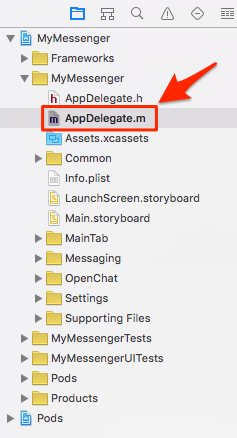

# Implement Open Chat

## Create the channels on JIVER Dashboard

You have to prepare channels for open chat in your application in order to implement open chat.

1. Sign in [JIVER Dashboard](https://dashboard.jiver.co).
2. Select **APPLICATION** on the side menu and click your app.
3. Click **CHANNELS** tab.
4. Click **CREATE CHANNEL** button.
5. Fill up the form about the channel you want to create.
6. Click **CREATE** button.

 
## Initialize JIVER framework

Open the sample project and **AppDelegate.m** in Xcode.



Initialize JIVER framework in ```application:didFinishLaunchingWithOptions:```

```objectivec
- (BOOL)application:(UIApplication *)application didFinishLaunchingWithOptions:(NSDictionary *)launchOptions {
    // Override point for customization after application launch.
    [Jiver initAppId:@"<YOUR_APP_ID>"];
    
    return YES;
}
```

## Implement channel loading

Open the sample project and **OpenChatChannelListViewController.m** in Xcode.


Add ```JiverChannelListQuery``` object for querying the channels.

```objectivec
@interface OpenChatChannelListViewController ()<UITableViewDataSource, UITableViewDelegate, UIImagePickerControllerDelegate> {
    NSMutableArray *channelArray;
    BOOL isLoadingChannel;
    JiverChannelListQuery *channelListQuery;
}
```

Insert following code to log in and query the channels into the bottom of ```viewDidLoad``` method.

```objectivec
- (void)viewDidLoad {
    [super viewDidLoad];
    // Do any additional setup after loading the view, typically from a nib.
    
    //...

    [Jiver loginWithUserId:[Jiver deviceUniqueID] andUserName:[MyUtils getUserName] andUserImageUrl:[MyUtils getUserProfileImage] andAccessToken:@""];
    channelListQuery = [Jiver queryChannelList];
    [channelListQuery nextWithResultBlock:^(NSMutableArray *queryResult) {
        for (JiverChannel *channel in queryResult) {
            [channelArray addObject:channel];
        }
        [self.openChatChannelListTableView reloadData];
    } endBlock:^(NSError *error) {

    }];
}
```

**User ID** is used for identifying each user in your application. This sample project uses the device ID(IDFV) for it. If there isn’t the user which has the user ID, JIVER will create the user with the ID.

Querying channels supports a pagination. Let’s implement the pagination.

```loadNextChannelList``` method will be invoked when the ```UITableView``` for channels draws the last row. If you scroll to the bottom of the ```UITableView```, the next page of channels will be fetched from JIVER server and attached to the bottom of the ```UITableView```.

Modify ```loadNextChannelList``` like this:

```objectivec
- (void)loadNextChannelList
{    
    if (![channelListQuery hasNext]) {
        return;
    }
    
    if (isLoadingChannel) {
        return;
    }
    isLoadingChannel = YES;

    [channelListQuery nextWithResultBlock:^(NSMutableArray *queryResult) {
        for (JiverChannel *channel in queryResult) {
            [channelArray addObject:channel];
        }
        [self.openChatChannelListTableView reloadData];

        isLoadingChannel = NO;
    } endBlock:^(NSError *error) {
        
    }];
}
```

If you run the sample project, you can see the channels which you create on the dashboard.

