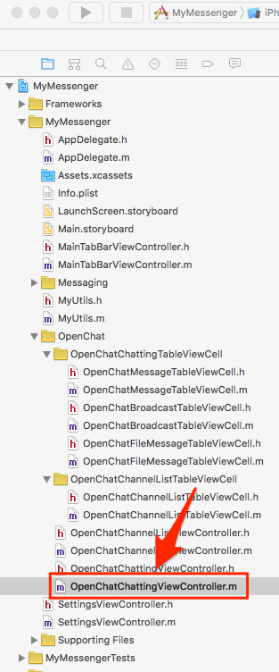

# Implement Transferring a Message

Open **OpenChatChattingViewController.m** in Xcode.



The UI for chat is consist of ```UITableView``` for messages, ```UIButton``` for sending an image, ```UITextField``` for entering a message and ```UIButton``` for sending a message. 

Insert following code to log in and query the channel list into the bottom of ```viewDidLoad``` method.